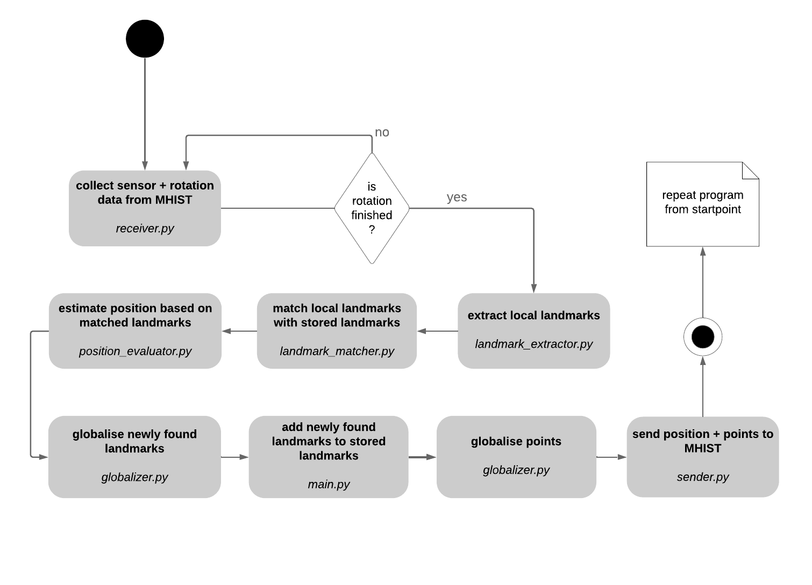

# SLAM

SLAM allows our robot to locate itself and map its environment simultaneously by measuring the environtment and performing landmark extracting and matching.

1. [Requirements](#1-requirements)
2. [Usage](https://github.com/codeuniversity/slam/tree/SLAM-technical-doc#2-usage)
3. [Project architecture](https://github.com/codeuniversity/slam/tree/SLAM-technical-doc#3-project-architecture)

### 1. Requirements

- python3
- [MHIST](https://github.com/alexmorten/mhist)  (MHIST is a simple on-disc measurement data base that stores and redistributes measurements consisting of a name, a value and optionally a timestamp through [grpc](https://github.com/grpc).)

### 2. Usage 

1. run [nervo](https://github.com/codeuniversity/nervo) and [MHIST](https://github.com/alexmorten/mhist) on Raspberry Pi
2. run [low level_controller](https://github.com/codeuniversity/slam/blob/master/motor_lidar/motor_lidar.ino) on Arduino
3. run SLAM with `make run` on raspberry pi

The [low level controller](https://github.com/codeuniversity/slam/blob/master/motor_lidar/motor_lidar.ino) continuously turns the motor (28BYJ-48 stepper) by 360 degrees. The Lidar sensor (VL6180 VL6180X) is fixed on the motor and makes range measurements of the environment. [Nervo](https://github.com/codeuniversity/nervo) receives the measurements and rotation data and puts them into MHIST.

### 3. Project architecture

The receiver runs on a separate process that continuously receives range data from MHIST and creates point batches of data from one full rotation. 
Then the landmark extractor iterates through the point batch and extracts local landmarks. Local means relative to the robot's current position instead of to the origin (aka the robot's first position).
Those extracted landmarks are then matched with landmarks from previous measurements in landmark matcher. 
From these matched landmarks we can estimate the new robot position. Knowing the position we can globalize the new landmarks and then add these to stored landmarks. We then also globalize the points. 
Lastly, we send both the position of the robot as well as the points to MHIST so that the [high-level-controller](https://github.com/codeuniversity/control-high) can retrieve the data and plan the robot's trajectory.

