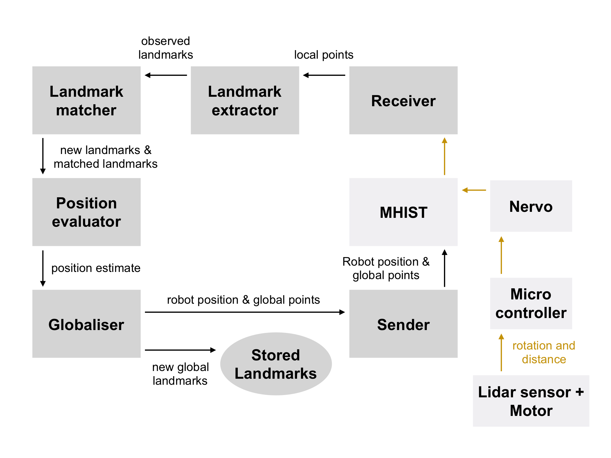

# SLAM

SLAM allows our robot to locate itself and map it's environment simultaneously.
This programm takes 360 degrees range data from a Lidar sensor and extracts distinct features, also known as landmarks
(e.g wall corners) from it. 
It then tries to match these newly found landmarks with previous observed ones to estimate the robot's current position.
 

1. **Requirements**
2. **Usage**
3. **Project architecture**

## 1. Requirements

#### Software:
- python3
- [MHIST](https://github.com/alexmorten/mhist)
- [nervo](https://github.com/codeuniversity/nervo)

#### Hardware:

- Arduino Uno,
- Raspberry Pi,
- 28BYJ-48 stepper motor using ULN2003 driver board
- Lidar sensor (30mm range)

## 2. Usage

nervo and MHIST should be running

execute Mainfile

## 3. Project architecture

Data that is received is in `[rotation,distance]` format

