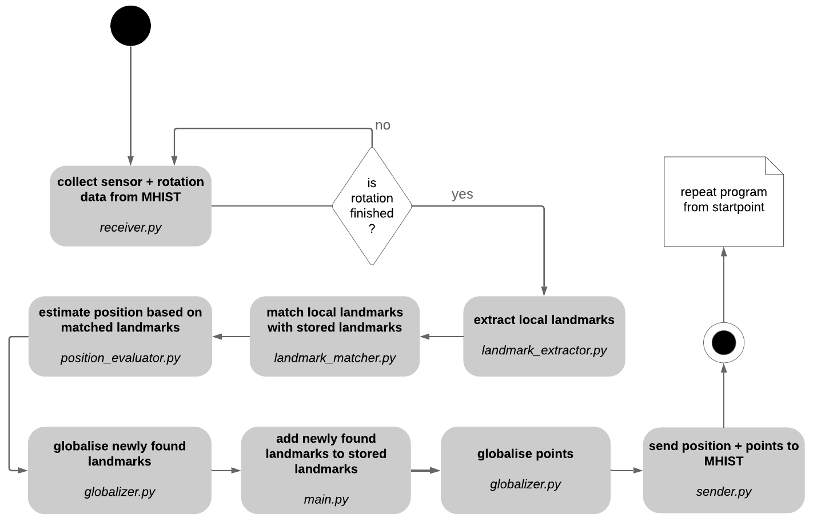

# SLAM

SLAM allows our robot to locate itself and map its environment simultaneously by measuring the environtment and extracting landmarks th previous observed ones to estimate 

1. [Requirements](https://github.com/codeuniversity/slam/blob/SLAM-technical-doc/README.md#1-requirements)
2. [Usage](https://github.com/codeuniversity/slam/tree/SLAM-technical-doc#2-usage)
3. [Project architecture](https://github.com/codeuniversity/slam/tree/SLAM-technical-doc#3-project-architecture)

### 1. Requirements

- python3
- [MHIST](https://github.com/alexmorten/mhist)  (MHIST is a simple on-disc measurement data base that stores and redistributes measurements consisting of a name, a value and optionally a timestamp through [grpc](https://github.com/grpc).)

### 2. Usage 

Hardware used:
- micro controller: Arduino Uno
- single board computer: Raspberry Pi
- motor: 28BYJ-48 stepper motor (with ULN2003 driver board)
- rangefinder: Lidar sensor VL6180 VL6180X (30cm range)

1. run [nervo](https://github.com/codeuniversity/nervo) and [MHIST](https://github.com/alexmorten/mhist) on raspberry pi
2. run [low level_controller](https://github.com/codeuniversity/slam/blob/master/motor_lidar/motor_lidar.ino) on Arduino
3. run SLAM with `make run` on raspberry pi

The [low level controller](https://github.com/codeuniversity/slam/blob/master/motor_lidar/motor_lidar.ino) continuously turns the motor by 360 degrees. The sensor is fixed on the motor and measures the distance to objects in the environment. [Nervo](https://github.com/codeuniversity/nervo) receives the measurements and rotation data and puts them into MHIST.

### 3. Project architecture

The receiver continuously receives range data from MHIST and creates point batches of data from one full turn. 
Then the landmark extractor iterates through the point batch and extracts landmarks.
Those extracted landmarks are then matched with landmarks from previous measurements in landmark matcher. 
From the matched landmarks we can estimate the new robot position. Knowing the position we can globalize the new landmarks and then add these to stored landmarks. We then also globalize the points. 
Lastly, we send both the position of the robot as well as the points to MHIST so that the [high-level-controller](https://github.com/codeuniversity/control-high) can retrieve the data and plan the robot's trajectory.

